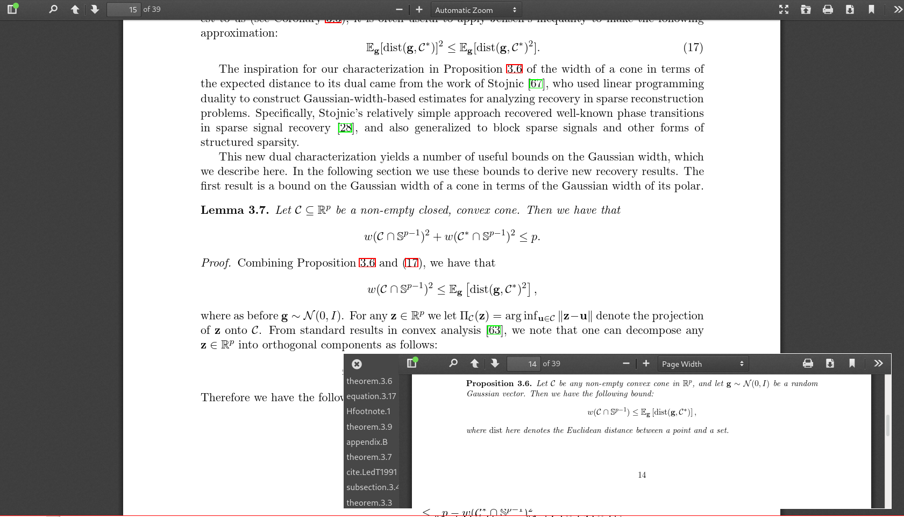

# PDF.js Popup Link Viewer

When reading papers in the browser, I find it helpful to be able to click on
references and look at the referenced text in a pop-up window. This hack on
[pdf.js](https://github.com/mozilla/pdf.js) implements this functionality:

- Click on any internal link to open a popup window jumping to linked text
- Drag popup window around or resize by dragging on top/bottom-left corners
- Ctrl/Command-click on a link to jump to it in main window
- History of previously clicked links stored in sidebar for quick referencing

A live version with an example pdf is hosted
[here](https://pdf.chenyang.co/web/viewer.html?file=https://arxiv.org/pdf/1012.0621.pdf).
